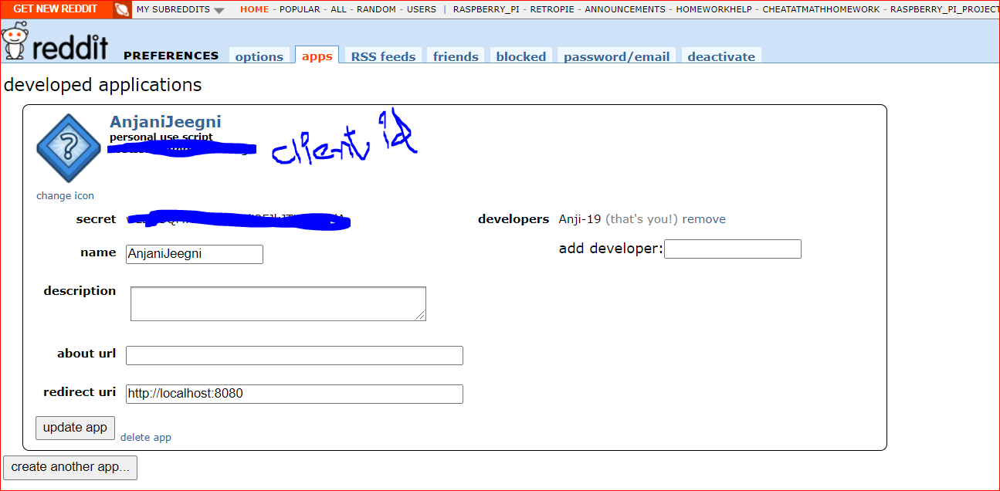

# RedditNewsData_SentimentAnalysis
# Data Visualization_Power BI

Here, We have done Sentiment Analysis on Reddit data.
Using the Reddit API we can get thousands of headlines from various news subreddits.

We are going to use NLTK's vader analyzer, which computationally identifies and categorizes text into three sentiments: 
positive, negative, or neutral.

To fetch a data from Reddit using API follow below steps:

1. Log into your account
2. Navigate to https://www.reddit.com/prefs/apps/
3. Click on the button that says "are you a developer? create an app..."
    Enter a name (username works)
    Select "script"
    Use http://localhost:8080 as a redirect URI
4. Once you click "create app", you'll see where your Client ID and Client Secret add in below code.

      
                           
                           
                           

 
 
 
 
 
      import praw
      reddit = praw.Reddit(client_id='<your_client_id>',
                           client_secret='<your_client_secret>',
                           user_agent='<your_user_name>')
                           
                           
NLTK’s built-in vander Sentiment Analyzer will simply rank a piece of text as positive, negative or neutral using a lexicon of positive and negative words.

We can utilize this tool by first creating a Sentiment Intensity Analyzer (SIA) to categorize our headlines, then we'll use the polarity_scores method to get the sentiment.

We are doing a positive label of 1 if the compound is greater than 0.2, and a label of -1 if compound is less than -0.2. Everything else will be 0.
                           
